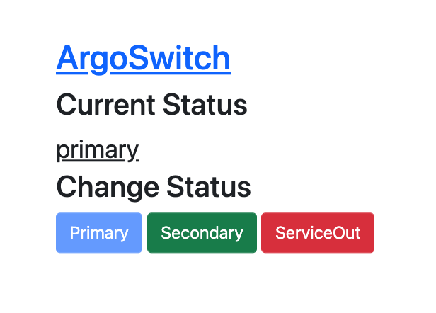
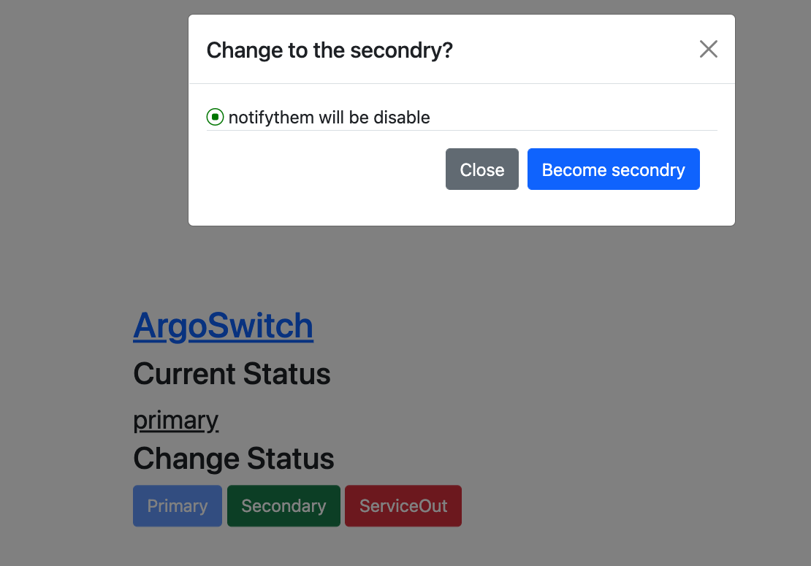

# ArgoSwitch

ArgoSwitch is updating ArgoCD Application Config.




## usage

You can defined behavior when cluster state is change.
```
apiVersion: argoproj.io/v1alpha1
kind: Application
metadata:
  name: example
  annotations:
    argoswitch.github.io/primary: sync
    argoswitch.github.io/secondry: disable
    argoswitch.github.io/service-out: delete
```

- sync: do sync.
- disable : stop auto sync.
- delete: delete application.

## Author
@pyama86
